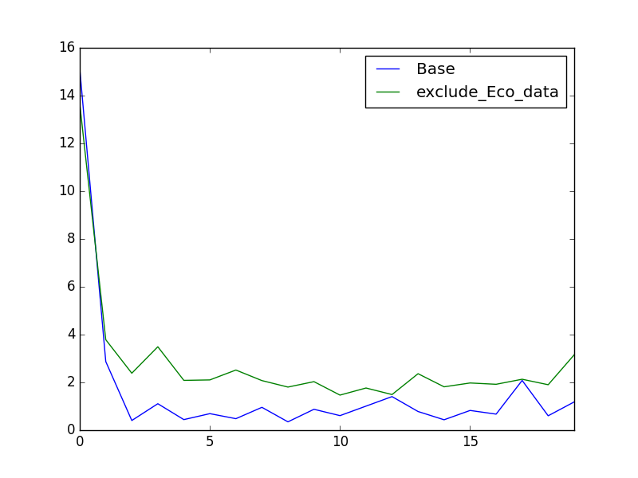
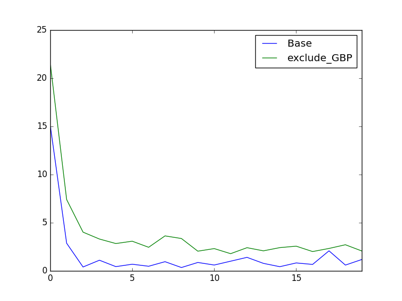
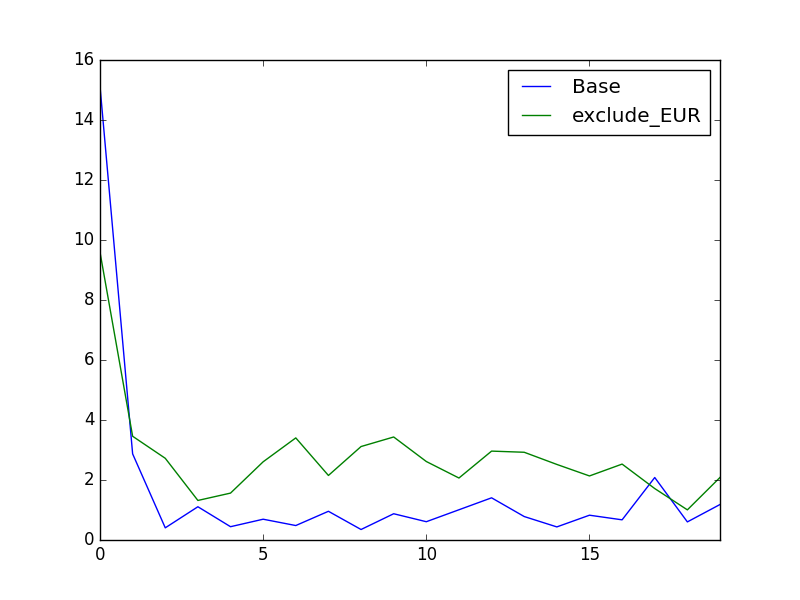
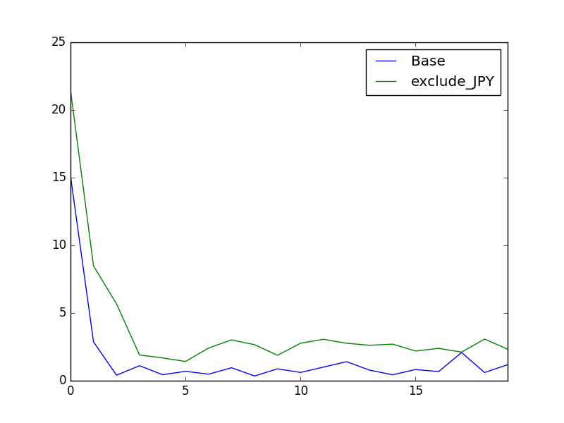

# Implementation Details

## Data
### Download Data
#### Countires or regions:
GBP, EUR, JPY, AUD, CAD, US

#### What:
- ALL:
Currency Rate, Main Equity Index, Government Bond Yield of 2, 5 and 10 years,
CPI, GDP, Unemployment Rate

- US:
Non-farm payroll, Expected CPI in 1 year, Expected unemployment rate in 1 year

### Data Change
#### outright value to changes
Government Bond Yield of 2, 5 and 10 years,
CPI, GDP, Non-farm payroll, Expected CPI in 1 year, Expected unemployment rate in 1 year

#### outright value to percentage changes
Currency Rate, Main Equity Index,Unemployment Rate

### Normalize Data
Used Min-Max normaliztion to normalize all the data to the range from 0 to 1.

### Training Data
- X:
Get samples by rolling the data from start date to end date, in a given a rolling window.
For example, samples:

    **`1990-01-01:1991-01-01`**

 **`1990-02-01:1991-02-01`**

 **`...`**

 **`2010-11-01:2010-12-01`**

- Y:
We are trying to predict **US Goverment Bond Yield 10 Years**'s change in next data point.

    **`goes up  : [0, 0, 1]`**

    **`not move : [0, 1, 0]`**

    **`goes down: [1, 0, 0]`**

## Model

- Put inputs into groups by countries. Used 5 inputs groups, each of them learned by a LSTM layer

- Merge 5 inputs layers and connect to next lever layer

- Stack 2 layers of LSTM

- Add a drop out layer to regulization

- Add one layer of fully connected network

- Output layer

## Results

[Results in Excel file](results/results.xlsx)

Base 
Y_in_X_1 

Y_in_X_6 

exclude_Eco_data 

exclude_GBP 

exclude_EUR 

exclude_JPY 

exclude_AUD 

exclude_CAD 
